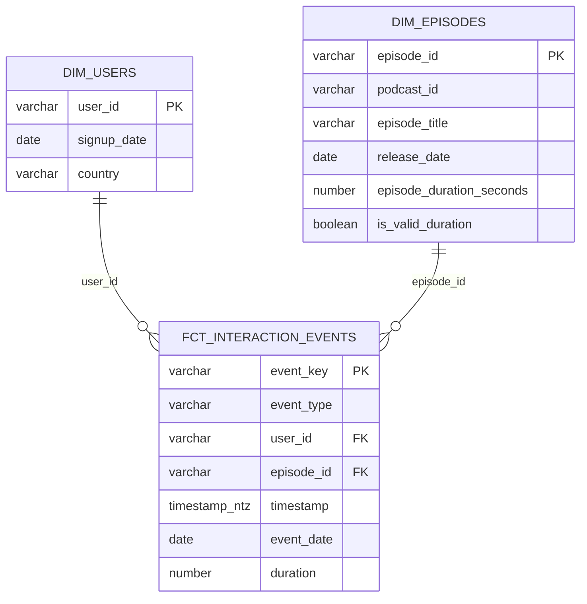

# Podcast Analytics Engineering Take-Home

## 1. Overview

This project uses dbt Core and Snowflake to transform mock podcast application
data into a tested analytical model and three reporting views. It addresses the
three requested areas in
[`global/TASK_README.md`](global/TASK_README.md):

| Task area | Implementation |
|---|---|
| Data modelling | A star schema with user and episode dimensions, an interaction-event fact, and the ERD below |
| Transformations | Layered dbt models, rejected-record visibility, explicit report-grain calculations, and data-quality tests |
| Analysis | Three `rpt_` views for episode completions, listen-through rate, and daily engaged listeners |

The supplied CSV files contain 5,000 interaction events, 100 users, and 50
episodes. They are loaded with dbt seeds because the exercise provides static
files rather than a production ingestion system.

### 1.1 What to review first

1. Read the architecture and modelling decisions to understand the data model.
2. Review the transformation rules and tests to understand data quality.
3. Review the three reporting models and their assumptions.
4. Follow the setup and run instructions to reproduce the project.

## 2. Architecture

```text
CSV seeds
  -> staging models
  -> valid and rejected event logic
  -> dimensions and interaction fact
  -> flat event view and report-specific metric-grain calculations
  -> reporting views
```

All objects are built in the schema selected by the active dbt target. Model
layers are not split into schemas in this take-home, which keeps development
objects together and avoids names such as `ANALYTICS_DEV_STAGING`.

### 2.1 Entity relationship diagram



### 2.2 Models, grains, and materializations

| Model | Grain | Materialization | Purpose |
|---|---|---|---|
| `stg_users` | One row per source user | View | Trim identifiers and safely parse user attributes |
| `stg_episodes` | One row per source episode | Incremental merge | Parse episode attributes and assess usable runtime |
| `stg_event_logs` | One row per exact normalized event | Incremental merge | Parse, key, and deduplicate interaction events |
| `int_valid_events` | One row per valid `event_key` | Ephemeral | Apply validity and referential-integrity rules |
| `int_rejected_events` | One row per rejected `event_key` | View | Expose rejected events and rejection reasons |
| `dim_users` | One row per `user_id` | Table | User attributes |
| `dim_episodes` | One row per `episode_id` | Table | Episode and podcast attributes |
| `fct_interaction_events` | One row per valid, deduplicated event | Table | Interaction measurements and dimension keys |
| `flat_interaction_events` | One row per valid `event_key` | View | Convenient denormalized event data |
| `rpt_*` | One row per report-specific output grain | View | Answers the three requested analyses |

### 2.3 Modelling decisions

1. Interaction events are facts because they record repeatable business
  activity. Users and episodes are dimensions because they describe the actor
  and content associated with each event.
2. The stable source `user_id` and `episode_id` values are retained as natural
  dimension keys. Surrogate dimension keys would add little value for this
  static, single-source dataset.
3. The source has no event ID. The `generate_event_key` macro calls
  `dbt_utils.generate_surrogate_key` over event type, user ID, episode ID,
  timestamp, and duration. Exact duplicates therefore share a key and are
  collapsed; non-identical repeated events remain separate.
4. All SQL models finish with a `final` CTE and `select * from final` to provide a
  consistent review pattern without changing model behaviour.
5. Missing descriptive values remain null during staging. Reporting replaces a
  missing country with `NOT MAPPED`, where a visible reporting category is more
  useful than a null group.

## 3. Transformations and data quality

### 3.1 Event acceptance rules

An event enters `fct_interaction_events` only when it:

1. It has a supported event type: `play`, `pause`, `seek`, or `complete`.
2. It has non-null, nonblank user and episode IDs.
3. Its timestamp is from `2000-01-01` to less than one day in the future.
4. Its duration is either null or non-negative.
5. It references an existing user and episode.

The lower timestamp bound catches implausible historical dates without
hard-coding the mock extract's observed 2024 date range. One day of future
tolerance allows minor clock skew or timezone misalignment between source
systems.

Source timestamps are parsed as Snowflake `TIMESTAMP_NTZ`, which is
timezone-naive and does not retain a timezone offset. The implementation
therefore assumes the supplied values have already been standardized to one
common timezone, ideally UTC. In production, ingestion should preserve the
original timestamp and offset, normalize an analytical timestamp to UTC, and
monitor future-dated records rather than relying on tolerance as a substitute
for timezone handling.

`int_rejected_events` makes invalid records inspectable instead of silently
discarding them. A malformed timestamp is converted to null by
`try_to_timestamp_ntz` and is consequently reported as a missing/invalid
timestamp. The original malformed timestamp text is not retained after staging;
preserving raw values would be a useful production enhancement.

The event `duration` field is kept separate from
`episode_duration_seconds`. The former is an event-provided measurement whose
business meaning is not defined in the source specification; the latter is the
episode runtime.

### 3.2 Incremental strategy

`stg_event_logs` and `stg_episodes` use Snowflake incremental `merge`, keyed by
`event_key` and `episode_id`. `on_schema_change='sync_all_columns'` keeps the
targets aligned with safe column additions or removals.

The seeds do not contain `_loaded_at` or another ingestion watermark. Each run
must therefore scan the complete seed input before merging, so the current
incremental configuration provides idempotent upserts but no scan reduction.
Commented examples in the models show where an `is_incremental()` watermark
filter could be added after a trustworthy ingestion timestamp exists. dbt seed
does not automatically create row-level load timestamps.

### 3.3 Test coverage

YAML-defined generic tests, including `dbt_expectations`, enforce:

1. Unique, non-null user, episode, and event keys.
2. Non-null fact foreign keys and timestamps.
3. User and episode referential integrity.
4. Accepted event types and timestamp ranges.
5. Non-negative event durations.
6. No duplicate valid events.
7. Valid episode-duration denominators for completion-rate observations.
8. The documented output grains and accepted metric ranges of the reporting
   views.
9. User and episode dimensions contain at least one row, preventing empty
    relations from passing only vacuous uniqueness and null checks.

Core integrity failures use error severity so invalid marts are not published as
successful builds. Run `dbt build` to build resources and execute their tests in
dependency order.

## 4. Requested analysis

The required answers live under `global/models/marts/reporting`, rather than
the dbt `analyses` directory, so both `dbt run` and `dbt build` create them in
Snowflake.

| Reporting model | Output and definition |
|---|---|
| `rpt_top_episodes_by_completion` | Top 10 episodes by valid completion-event count during the latest seven calendar days represented in the dataset |
| `rpt_average_listen_through_by_country` | Average of the maximum capped completion rate per user and episode, grouped by country |
| `rpt_highly_engaged_daily_listeners` | Distinct users with at least three distinct played or completed episodes on at least one calendar day |

Detailed definitions, grains, null rules, and known limitations are documented
in [`global/docs/metric_definitions.md`](global/docs/metric_definitions.md).

### 4.1 Analysis assumptions

1. The latest seven-day window uses the maximum valid event date in the dataset
  plus the preceding six calendar days, rather than the system date.
2. Repeated non-identical completion events count separately in the completion
  leaderboard because the source has no unique event or session ID.
3. Listen-through rate assumes a completion event's `duration` can proxy for
  listening duration. It is divided by episode runtime and capped at 100%.
4. Taking the maximum rate per user and episode prevents repeated completions
  from disproportionately weighting the country average.
5. A daily listen is a `play` or `complete`. Repeated activity for the same user,
  episode, and day counts once.
6. Exact session-level listening behaviour cannot be reconstructed because the
  data has no `session_id`, playback position, seek destination, or explicit
  definition of event duration.
7. Source timestamps contain no timezone offset. Calendar-day metrics assume all
  timestamps use the same timezone; results could otherwise assign events to
  the wrong day.

These assumptions make the requested metrics reproducible, but they should be
confirmed with product stakeholders before production use.

## 5. Project structure

```text
global/
|-- macros/
|   `-- generate_event_key.sql
|-- models/
|   |-- staging/
|   |-- intermediate/
|   `-- marts/
|       |-- dimensions/
|       |-- facts/
|       `-- reporting/
|-- seeds/
|-- docs/
|   `-- metric_definitions.md
|-- dbt_project.yml
|-- packages.yml
`-- profiles.yml
```

## 6. Setup

### 6.1 Prerequisites

1. Python 3.
2. Access to Snowflake.
3. A Snowflake role with warehouse usage and permission to create and modify
   objects in the target schema.

From the repository root, create an environment and install the pinned
dependencies:

```bash
python -m venv .venv
source .venv/bin/activate
python -m pip install --upgrade pip
python -m pip install -r global/requirements.txt
```

On Windows PowerShell, activate the environment with:

```powershell
.venv\Scripts\Activate.ps1
```

### 6.2 Snowflake configuration

The committed `global/profiles.yml` reads credentials and object names from
environment variables and exposes `dev` and `prod` targets. `dev` is the
default; production must be selected explicitly.

For Bash or a similar shell, set these values before running dbt:

```bash
cd global
export DBT_PROFILES_DIR="$(pwd)"
export SNOWFLAKE_ACCOUNT="<account-identifier>"
export SNOWFLAKE_USER="<username>"
export SNOWFLAKE_PASSWORD="<set-securely>"
export SNOWFLAKE_ROLE="<role>"
export SNOWFLAKE_DATABASE="<database>"
export SNOWFLAKE_WAREHOUSE="<warehouse>"
export SNOWFLAKE_SCHEMA="<development-schema>"
export SNOWFLAKE_PROD_SCHEMA="<production-schema>"
```

Do not commit the Snowflake password to this repository. Set it in the local
shell, a password manager, or a CI secret store. Rotate any password that has
been exposed in plaintext. For production, prefer key-pair authentication or a
managed secret store.

## 7. Run the project

Run all commands from `global/`.

### 7.1 First run or complete reset

Use a full refresh for a new environment and after cloning the project:

```bash
dbt deps
dbt debug
dbt build --full-refresh
```

1. `dbt deps` installs `dbt_utils` and `dbt_expectations`.
2. `dbt debug` validates the profile and Snowflake connection.
3. `dbt build --full-refresh` loads all three seeds, recreates incremental
   models, builds downstream models, and runs tests in dependency order.

An additional `dbt seed` command is not required before `dbt build`; seeds are
part of the build graph because staging models reference them with `ref()`.

### 7.2 Routine development runs

After the initial build, use:

```bash
dbt build
```

This reloads changed seeds, merges the incremental staging models, rebuilds
downstream tables and views, and runs the relevant tests.

### 7.3 When to use `--full-refresh`

Use `dbt build --full-refresh` when:

1. Creating the project in a new schema or environment.
2. Changing incremental model logic, unique keys, or column types.
3. Changing historical seed data or removing rows from a seed.
4. Recovering from stale or inconsistent incremental state.
5. Intentionally rebuilding all historical data.

A full refresh recreates incremental relations, so it is more expensive and
should not be the default for routine production runs.

### 7.4 Other useful commands

```bash
# Build only the reporting layer and its upstream dependencies
dbt build --select +path:models/marts/reporting

# Re-run all tests without rebuilding models
dbt test

# Explicit production deployment
dbt build --target prod

# Generate browsable dbt documentation
dbt docs generate
dbt docs serve
```

## 8. Orchestration approach

### 8.1 Portainer deployment

The repository includes `global/docker-compose.yml`, which creates two services:

1. `dbt-scheduler` runs the production dbt build at startup and then once each
   day. After a successful build it generates and publishes dbt docs.
2. `dbt-docs` serves the most recently successful documentation with Nginx.

In Portainer Business Edition:

1. Push this repository to a private Git repository accessible by Portainer.
2. Open **Stacks**, choose **Add stack**, select **Git repository**, and enter
   the repository URL and credentials.
3. Set **Compose path** to `global/docker-compose.yml` and enable automatic Git
   updates/webhooks if desired.
4. Add the environment variables shown in `global/.env.portainer.example` in
   Portainer. Store the Snowflake password as a secret or restricted stack
   variable; do not commit a populated `.env` file.
5. Deploy the stack and inspect the `dbt-scheduler` logs. By default it runs
   immediately and then every day at 07:00 UTC.

The documentation is exposed at `http://<vps-address>:33005`. To publish it at
`https://docs.example.com`, create a DNS record pointing to the VPS and configure
the VPS's existing reverse proxy to forward that hostname to port 33005. Enable
TLS and authentication at the proxy; dbt docs expose model names, compiled SQL,
lineage, and warehouse metadata. If the reverse proxy runs in Docker, attach
`dbt-docs` to its external network and proxy directly to `dbt-docs:80` instead
of publishing the host port.

Useful stack settings are:

| Variable | Default | Meaning |
|---|---:|---|
| `TZ` | `UTC` | IANA timezone used by the schedule |
| `DBT_RUN_TIME` | `07:00` | Daily local run time in 24-hour `HH:MM` format |
| `DBT_RUN_ON_START` | `true` | Run once when the scheduler container starts |
| `DBT_TARGET` | `prod` | dbt profile target |
| `DBT_FULL_REFRESH` | `false` | Add `--full-refresh` to every scheduled build |
| `DBT_DOCS_PORT` | `33005` | VPS port mapped to Nginx port `33006` |

If a run fails, the scheduler logs the error, remains alive for the next daily
attempt, and keeps serving the last successfully generated documentation. A
container restart also triggers an immediate retry while `DBT_RUN_ON_START` is
enabled.

A production workflow would:

1. Ingest source data and attach a trustworthy `_loaded_at` value.
2. Run source checks and freshness checks.
3. Execute `dbt build` in dependency order.
4. Stop publication on core test failures.
5. Publish dbt artifacts and alert the owning team on failure.

Transient Snowflake failures should use bounded retries. Pull requests should
run parse/compile and modified-model builds in isolated CI schemas. Development
and production should use separate schemas and least-privilege roles.
Warehouses should use auto-resume, short auto-suspend intervals, query tags,
and resource monitors where appropriate.

## 9. Production improvements

The following are intentionally outside the mock-data implementation:

1. Managed ingestion with a true row-level `_loaded_at`.
2. Late-arriving event handling and efficient watermark-based incrementality.
3. Source freshness checks based on ingestion metadata.
4. Preservation of original raw values alongside typed staging columns.
5. Explicit source timezone capture and UTC normalization.
6. Snapshots for changing user attributes.
7. State-based CI selection and deployment.
8. SQLFluff formatting and linting with the dbt templater.
9. Pre-commit hooks for SQLFluff, YAML validation, trailing whitespace, and
   `dbt parse`.
10. CI enforcement of the same formatting, parsing, and validation checks.
11. Automated anomaly detection.
12. Sessionization after a trustworthy session identifier becomes available.

Seed column types and tests are configured, but dbt model contracts are not
applied to seeds. For production source tables, enforce contracts at the
ingestion boundary and add source freshness and volume monitoring.
